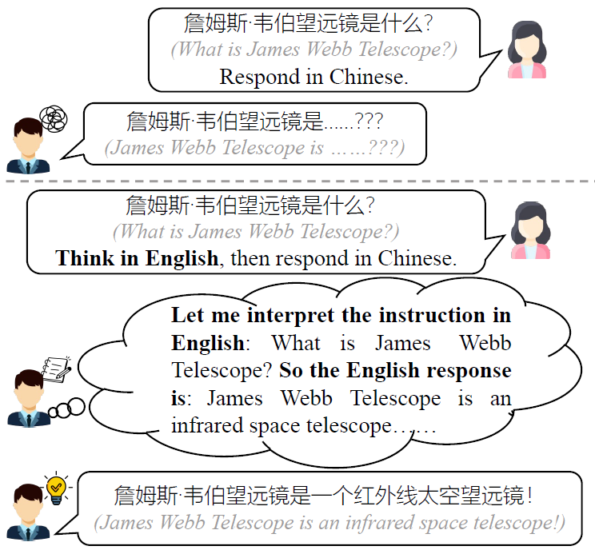

# :zap: PLUG: Pivot Language Guided Generation

This is the repository for **PLUG** (**P**ivot **L**anguage g**U**ided **G**eneration), a simple yet effective method for the cross-lingual instruction tuning of large language models (LLMs). PLUG utilizes a high-resource language as the pivot to enhance instruction tuning in low-resource languages. It trains the model to first process the instruction and draft a response in the pivot language, before producing the final response in the target language. PLUG is proved to significantly improve the instruction-following abilities of LLMs in multiple target languages (Chinese, Korean, Italian, Spanish), compared to directly responding in the target language alone. For more details, please refer to our paper "[:zap:*PLUG: Leveraging Pivot Language in Cross-Lingual Instruction Tuning*](https://arxiv.org/abs/2311.08711)".

<center></center>

### Environment

```bash
pip install torch==2.0.1
pip install transformers==4.31.0 deepspeed==0.9.5 accelerate==0.21.0
# You may need to install a version of openai that is before 1.0.0. 
# Otherwise, you may need to change the API request URL 
# in src/util/gpt_utils.py
pip install openai tiktoken tqdm peft huggingface_hub datasets 
# Only for evaluating X-AlpacaEval
pip install shortuuid anthropic
```

### Code

Code can be found in `src` directory, which contains the following sub-directories:

- `ds_config`: the configuration files for DeepSpeed.
- `model`: code for LLM training (instruction tuning a.k.a. SFT) and inference
- `evaluate`: code for evaluating instruction-tuned LLMs on X-AlpacaEval, X-TruthfulQA, X-SVAMP
- `translation`: code for translating training data (instructions and responses) to target languages
- `utils`: utility function for OpenAI API calls

Please refer to the corresponding directory for detailed information.

### Data

We provide the following data used in our experiments

- [Training data](https://drive.google.com/drive/folders/1-Uz_fKQDwDEAmmDx4bBY2Iehpk6PkpS7?usp=sharing): The training data used in the paper. We used the GPT4-Alpaca instruction tuning dataset and translated it into 4 target languages with GPT-3.5-turbo.
- Evaluation benchmarks:
    - [X-AlpacaEval](https://huggingface.co/datasets/zhihz0535/X-AlpacaEval): The main benchmark we used to evaluate the open-ended instruction-following abilities of LLMs. The benchmark was collected by hiring professional human translators to translate the original English [AlpacaEval](https://huggingface.co/datasets/tatsu-lab/alpaca_eval) into 4 target languages. We used GPT-4 as the judge to compare responses from two models. We used the evaluation code from [MT-bench](https://github.com/lm-sys/FastChat/tree/main/fastchat/llm_judge), with a small edit in the GPT-4 prompt (specified in Appendix B of our paper).
    - [X-TruthfulQA](https://huggingface.co/datasets/zhihz0535/X-TruthfulQA_en_zh_ko_it_es): Auxiliary experiments in our paper that evaluates the truthfulness of multilingual LLMs. We evaluated LLMs in a zero-shot generative setting: prompt the instruction-tuned LLM with the question, collect its answer, and let GPT-4 compare the answer with the reference answers.
    - [X-SVAMP](https://huggingface.co/datasets/zhihz0535/X-SVAMP_en_zh_ko_it_es): Auxiliary experiments in our paper that evaluates the reasoning abilities of multilingual LLMs. We evaluated LLMs in a zero-shot generative setting: prompt the instruction-tuned LLM with the question, collect its response (a chain-of-thought rationale), and let GPT-3.5-turbo extract the predicted answer from the response. Then, we compared the extracted answer with the reference answer to calculate accuracy.
 
### Citation

If you find our data or code useful, please kindly cite our paper:
```
@article{zhang2023plug,
  title={PLUG: Leveraging Pivot Language in Cross-Lingual Instruction Tuning},
  author={Zhang, Zhihan and Lee, Dong-Ho and Fang, Yuwei and Yu, Wenhao and Jia, Mengzhao and Jiang, Meng and Barbieri, Francesco},
  journal={arXiv preprint arXiv:2311.08711},
  year={2023}
}
```
